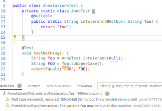

# Annotations

Shows how to enable the @Nullable and @NotNull annotations,
so that vscode shows you potential errors. 



Keys:

Add this to build.gradle:

```
    implementation 'org.jetbrains:annotations:24.0.0'
```

Configure vscode to turn on null annotation checking

```
    "java.compile.nullAnalysis.nullable": [
        "org.jetbrains.annotations.Nullable"
    ],
    "java.compile.nullAnalysis.nonnull": [
        "org.jetbrains.annotations.NotNull"
    ],
    "java.compile.nullAnalysis.mode": "automatic"
```

Caveats:

The static analyzer only looks at local context: if you pass
a maybe-null reference down a chain of function calls, if
the whole chain is not annotated, then you won't see any errors.