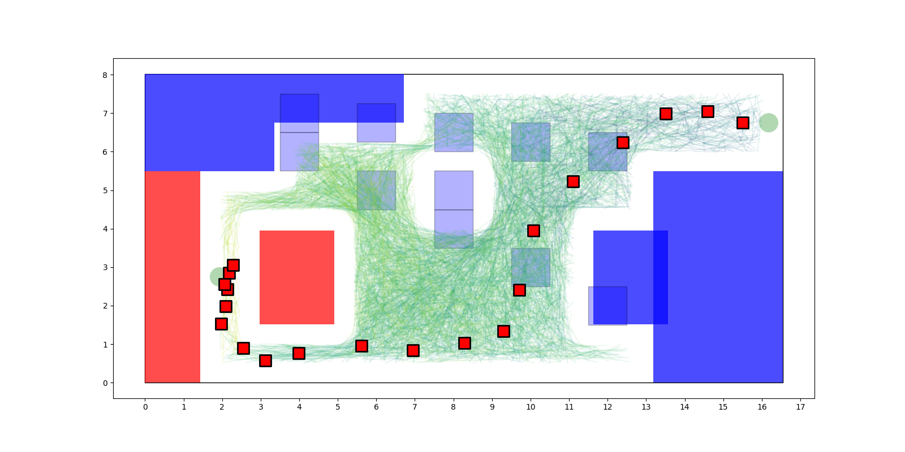

# Generalized Label Correcting

This is a path planning method described in by Brian Paden's 2017 thesis.

https://arxiv.org/pdf/1607.06966v4.pdf

The general idea:

* forward simulate some samples in control space
* build a tree of states, forward simulating each segment
* prune segments that yield the same state partition at higher cost

This is a straight port of C++ to Java based on Brian's own implementation:

https://github.com/bapaden/Global-Trajectory-Optimization
