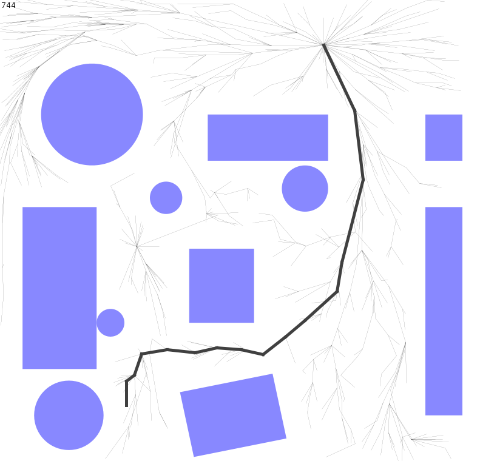

# Parallel Rapidly-exploring Randomized Trees *

This is an example of 4 threads in 20ms, not terrible.
To run it, find the ArenaFrame class and run its main method.
Vscode should put a little "run" button nearby.

Adapted from Jeff Ichnowski's project

https://github.com/jeffi/prrts-j

# TODO:

* remove some of the generality (e.g. multiple robots)
* attach it to FRC stuff