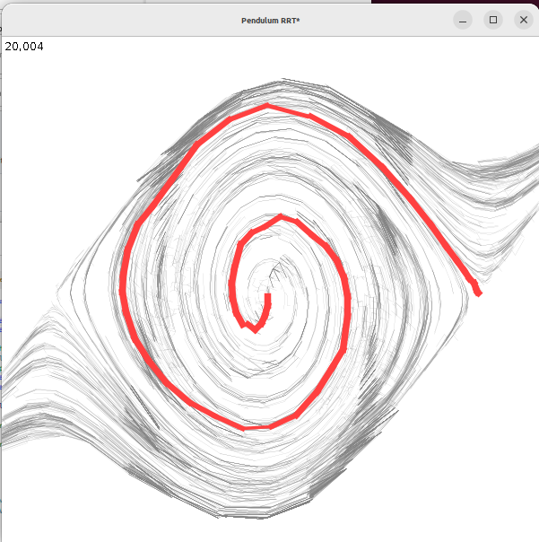

# Parallel Rapidly-exploring Randomized Trees *

This is an example of 4 threads in 20ms, not terrible.
To run it, find the ArenaFrame class and run its main method.
Vscode should put a little "run" button nearby.

This is an example of a one-joint pendulum swing-up solution,
using LQR cost and gain to calculate feasible links.
To run it, click "simulate robot".

PRRTS adapted from Jeff Ichnowski's project

https://github.com/jeffi/prrts-j

LQR-RRT* adapted from

http://people.csail.mit.edu/tlp/pdf/2012/ICRA12_1657_FI.pdf

https://github.com/MahanFathi/LQR-RRTstar

# TODO:

* remove some of the generality (e.g. multiple robots)
* attach it to FRC stuff