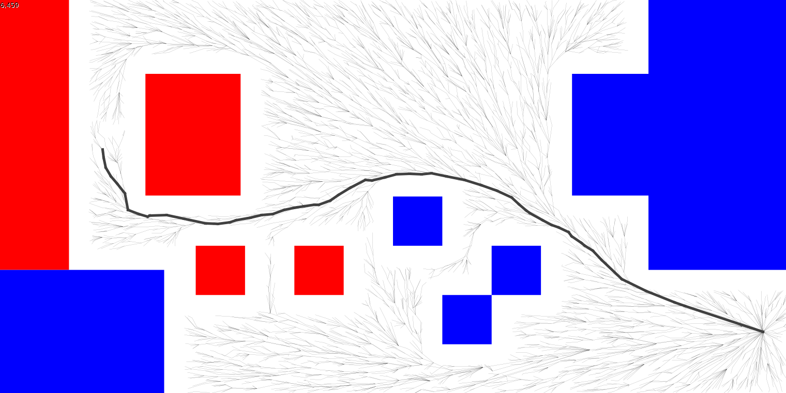
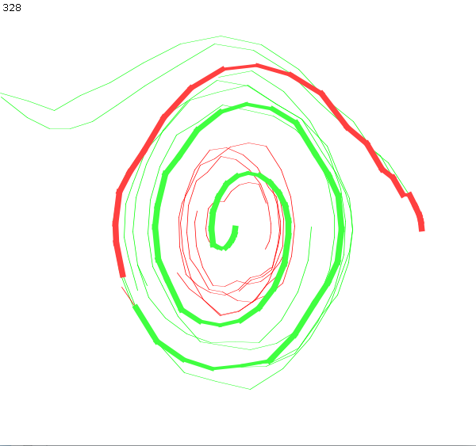

# RRT* -- Rapidly-exploring Randomized Trees ... Star

This is a popular type of sampling planner which works
by picking random states, finding near neighbors in the tree,
"steering" the random state reasonably close to the neighbor,
adding it to the tree, and then "rewiring" the tree to take
advantage of any new shorter-than-before paths.  RRT* is
"asymptotically optimal".

Below is an example of navigating the 2023 field; this is 100ms of
work on my machine, which achieves about 6000 steps.

This path does not incorporate the system physics, which is
why it has some jaggedness.  With physics, we can get smoother
paths in fewer iterations, which is called "Kinodynamic planning."

To run it, find the ArenaFrame class and run its main method.
Vscode should put a little "run" button nearby.

A more complicated example is below.
This is an example of a one-joint pendulum swing-up solution,
using LQR cost and gain to calculate feasible links.  It has
some trouble finding the goal at the end, since the physics tends
to push the trajectories away from that point; a bidirectional
approach would fix that.

To run it, click "simulate robot".

## Credit

This is adapted from the parallel version in studies2023/prrts.

I think the parallel stuff makes it too hairy to experiment with,
which defeats the educational purpose imho.  Our problem-spaces are pretty
simple and our compute power is not too high anyway.

PRRTS itself is adapted from Jeff Ichnowski's project

https://github.com/jeffi/prrts-j

LQR-RRT* adapted from

http://people.csail.mit.edu/tlp/pdf/2012/ICRA12_1657_FI.pdf

https://github.com/MahanFathi/LQR-RRTstar

## TODO:

* attach it to FRC stuff, e.g. trajectory state types etc.
* bidirectional
* physics